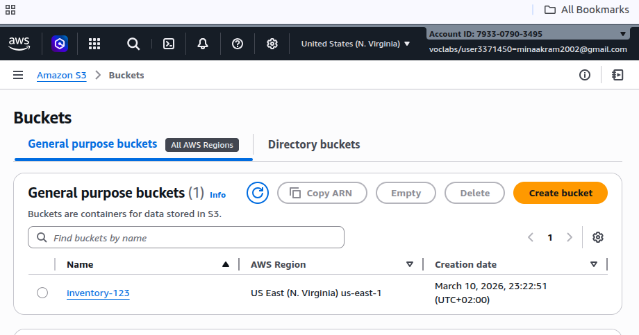
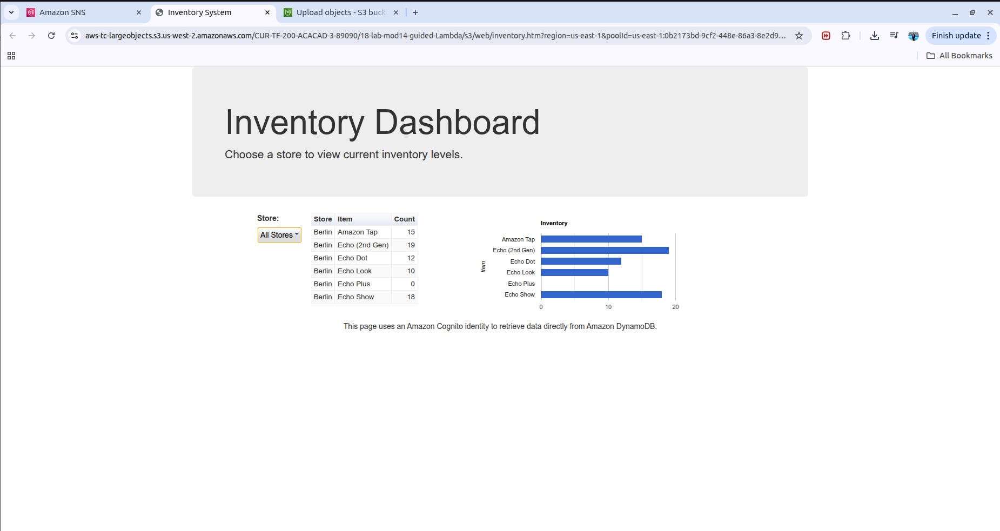

# ☁️ AWS Serverless Inventory Management System

## 📌 Overview
This project demonstrates a fully automated, **event-driven inventory system**. It leverages AWS serverless services to process data uploads, maintain a NoSQL database, and trigger real-time alerts—all without managing any underlying servers.

## 🛠️ Architecture & Services
* **Amazon S3**: Acts as the entry point for inventory CSV files.
* **AWS Lambda**: Executes Python logic for data parsing and stock validation.
* **Amazon DynamoDB**: Stores inventory records and provides a stream for real-time monitoring.
* **Amazon SNS**: Handles automated email notifications for out-of-stock events.

## 🚀 Key Features
* **Zero Infrastructure Management**: Fully serverless using AWS Lambda.
* **Scalability**: Handles multiple simultaneous file uploads seamlessly.
* **Cost-Efficient**: Pay-as-you-go model with near-zero idle costs.

## 📸 System Screenshots

### 1. Data Source (S3 Bucket)

*S3 Bucket configured as the event trigger for the pipeline.*

### 2. Processing Engine (Lambda)

*Visualizing the Lambda functions and their logic.*

### 3. Database (DynamoDB)

*Inventory items successfully stored in the NoSQL table.*

### 4. Real-time Alert (SNS)

*Automated notification received for out-of-stock items.*

## 📁 Repository Structure
* `*.csv`: Sample inventory datasets used for testing.
* `scripts/`: Python source code for the Lambda functions.
